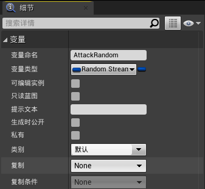
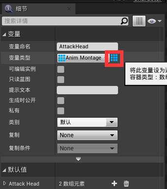

# 一些小技巧
### 蓝图中如何写随机事件？
* 例如随机攻击
* 首先创建随机流变量（Random Stream）

* 由于是做动画蒙太奇随机，因此创建动画蒙太奇变量（如果是声音就创建声音变量），创建后将类型改为数组（后面蓝色九宫格图标代表数组）

* 首先将动画蒙太奇数组连接至get再连接到Play Anim Montage函数的蒙太奇动画上，再将随机变量连接至Random Integer in Range from Stream再将其返回值连到Get上即可
 
