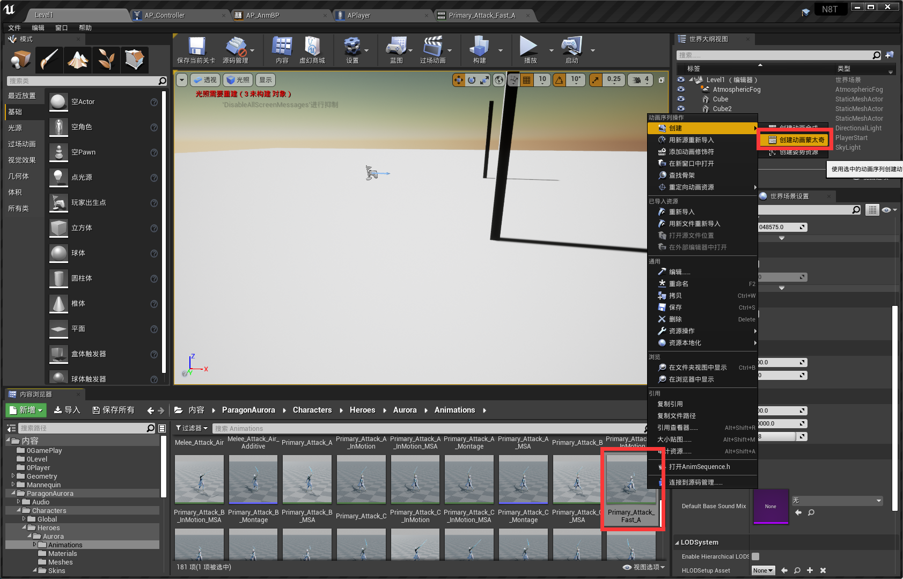
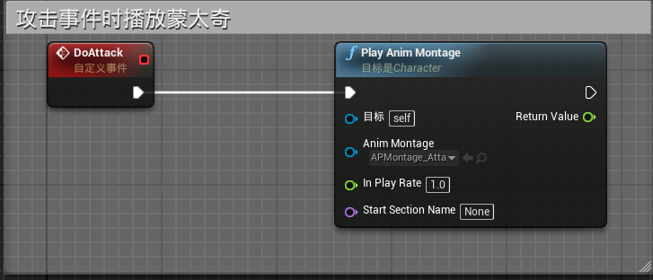
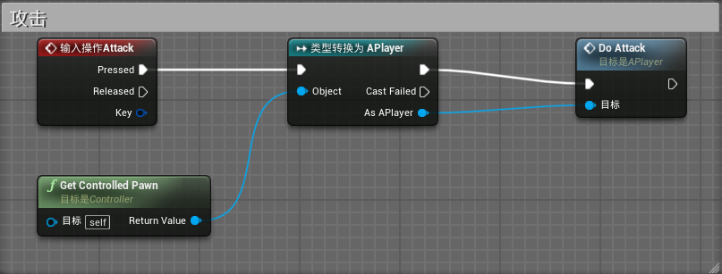
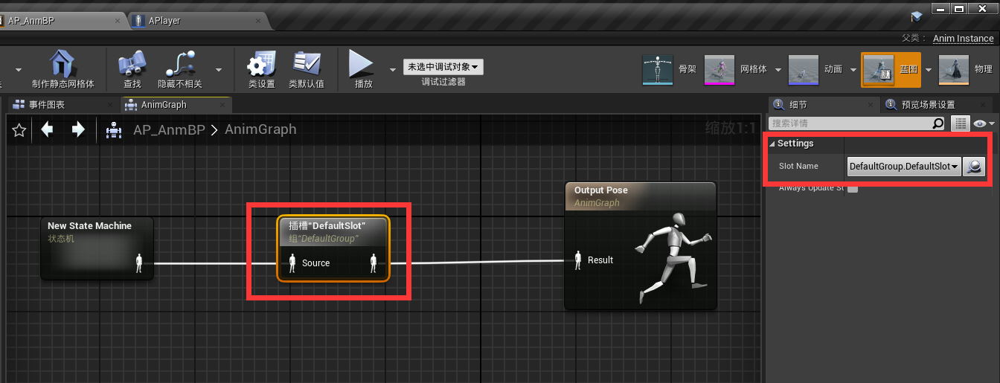
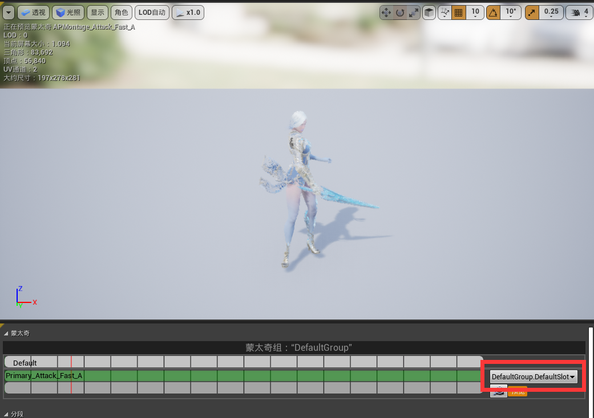
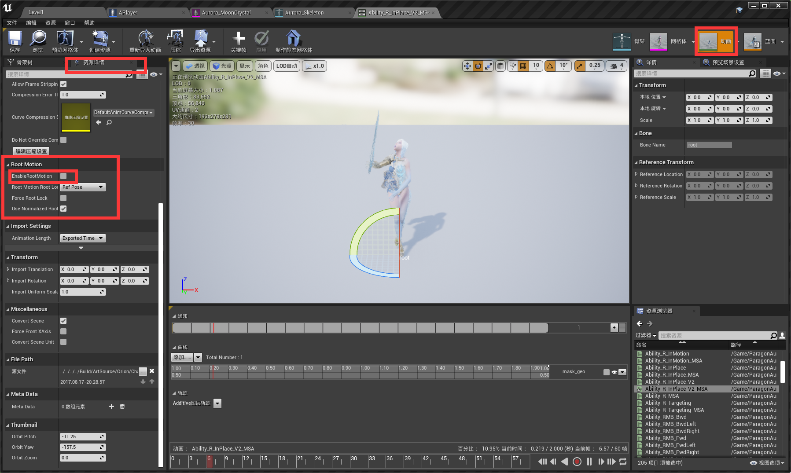

# 制作动画蒙太奇
----
### 制作一个攻击动画
* 由于动画和动画之间的衔接是生硬的，非自然的，因此需要用动画蒙太奇来从一个动画自然过渡到另一个动画。例如攻击行为，是在走路的瞬间播放攻击动画，这两个画面是非连续的。

* 右键你想要制作蒙太奇的动画文件，选择创建动画蒙太奇，然后将文件放入APlayer中（方便你自己查看）

* 项目设置，输入项中设置操作映射，新建一个叫Attack的左键鼠标攻击项目

* 由于攻击是具体到角色来执行的，因此Doattack的行为放到APlayer中去做。而Controller主要负责监听玩家操作的，因此稍后在Controller中去做监听鼠标的动作。在角色(APlayer)的事件图表中创建DoAttack事件，连接PlayAnimMontage函数，选择刚才我们创建的那个蒙太奇。

* 在Controller的事件图表中去监听输入操作(左击鼠标)。创建监听Attack，并且将Pawn类型转换为APlayer，然后连接到刚才创建的DoAttack事件中

* 在角色动画蓝图中(AP_AnmBP)加入一个插槽DefaultSlot，该插槽专门用以播放蒙太奇，此时就已经可以播放攻击动画了。

* 注意这个插槽右侧的组是默认组的默认插槽，这个和你动画蒙太奇点进去后帧数旁边所对应的组是相同的，你可以自定义各种各样的组。

* 对于会对角色产生位移的动画，可以开启RootMotion让角色跟随动画进行位移（而不重新回到动画开始的起点）

&nbsp;

*如果您发现此章节有任何问题欢迎上报至 Issue*  
*If any problems were found, please do not hesitate to create an issue.*

[下一章：动画声音，特效和连击](https://github.com/YiLiuNat/UnrealEngine4_Notes/blob/master/05.SoundsCombo.md)  
[回到主目录](https://github.com/YiLiuNat/UnrealEngine4_Notes)