# 动画的声音，特效与三连击

### 给动画创建声音

* 在你想使用的声音上创建声音Cue（声音无法做编辑，但Cue可以）
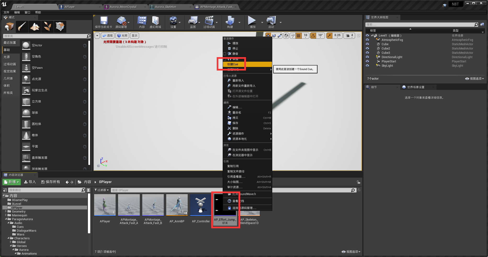

* 双击Cue音源可以添加随机延迟和随机变调
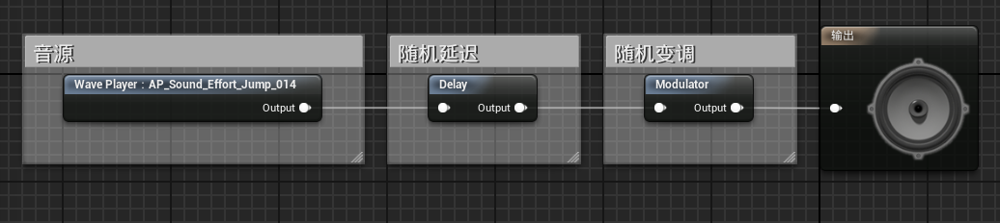

* 在动画蒙太奇帧数下方的通知条形中，右键添加通知，PlaySound
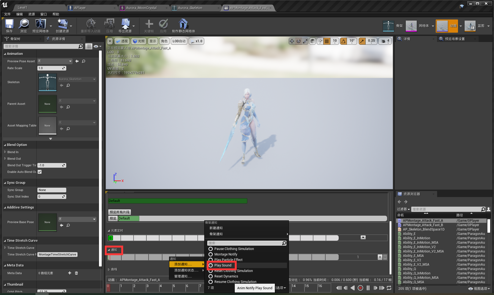

* 然后在右侧添加刚才创建的声音Cue
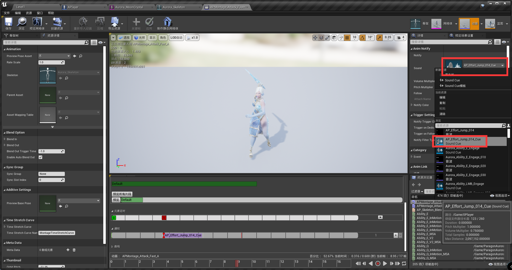

### 给动画添加特效
* 的在通知轨上右键创建粒子特效播放
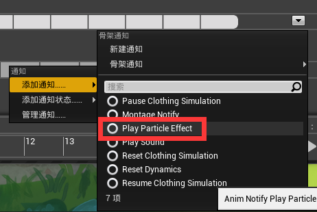

* 选择特效后可调节特效的位置，角度和缩放比
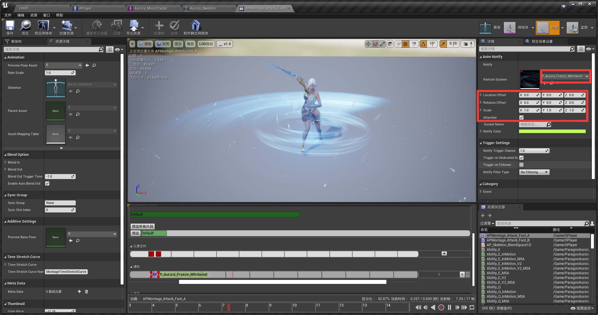

### 贴近骨骼的特效
* 在武器骨骼上创建骨骼插槽，武器通常自带插槽，没有就右键你想装特效的骨骼创建插槽
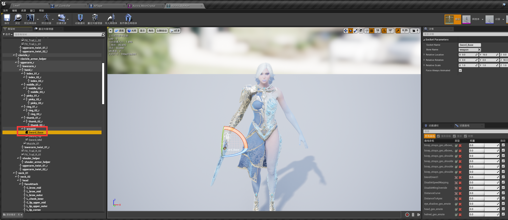

* 在通知轴放入特效后Socket Name为刚才的插槽名即可
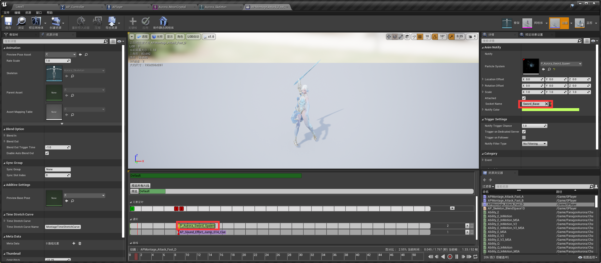

### 三连攻击模式的写法
* 在APlayer角色的事件图表中写如下
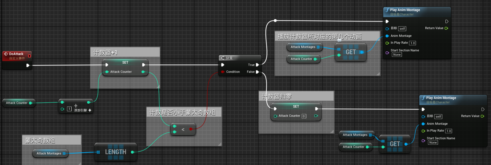
* 首先创建蒙太奇数组，攻击计数器变量
* 逻辑如下：
攻击触发（鼠标左击）计数器+1，判断计数器是否小于蒙太奇数组中蒙太奇的个数，小于时返回True，播放计数器所对应的第几个动画；大于时返回False，计数器归零，播放计数器对应动画（第0个动画）。

### 完整攻击一次再开始下一次
* 原理是在每次攻击动画中 只有一小段时间可以让用户触发连击
* 在通知时间轴上，连击开始和结束的两个时间点上分别添加新通知
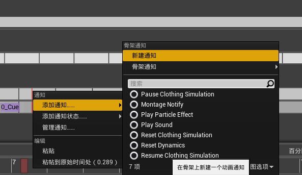

* 我们这里将其命名为ComboOpen和ComboClose，意为连击窗口期的开始和关闭。
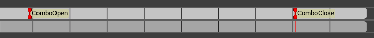

* 在角色APlayer事件图表中创建2个自定义事件，ComboAttackSave和ResetCombo，这两个事件用来连接动画蓝图
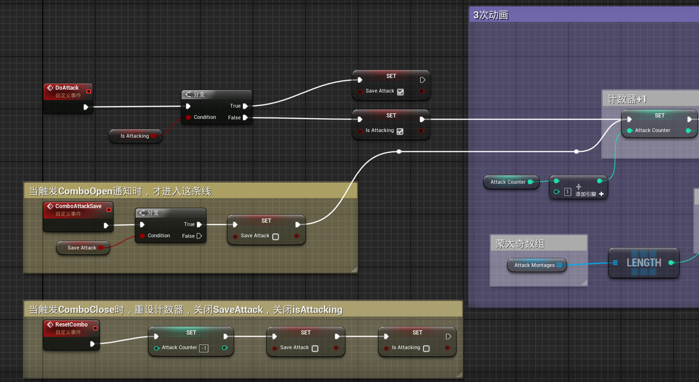

* 在动画蓝图的事件图表中添加之前创建的ComboOpen和ComboClose，将其转换APlayer类型后连接到刚才创建的两个角色事件。
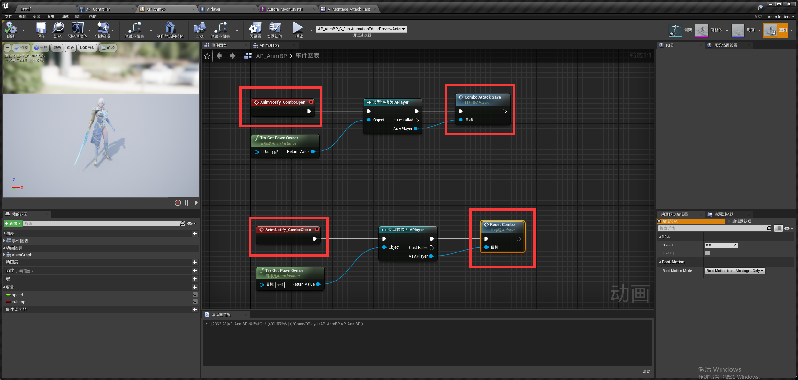

* 逻辑如下
	1. 一旦攻击，在攻击期间再点第二次鼠标SaveAttack则会变为True，当SaveAttack为True时，动画播放到ComboOpen时会自动触发下一次攻击。
	2. ComboOpen是先在动画蓝图中被触发,蓝图通过ComboAttackSave事件进入APlayer。
	3. APlayer中的ComboAttackSave发现你曾点过第二次鼠标(SaveAttack被设为True)，它会先将其改设为False然后触发下一次攻击。
	4. 如果动画播到了ComboClose(用户错过了combo时间)，则进入ResetCombo事件，重置连招计数器，SaveAttack isAttacking也都将重新设为False.