### 创建一个小怪模型
* 新文件夹建一个新的蓝图类，Character类，命名为AMonster_Base，由于是基础小怪，因此后面加个base

* 进入后选一个Mesh

### 创建打击判定（动画通知）
* 上一章讲过如何在动画中创建一条通知，除了在通知轨道上点创建，还可以在文件目录里创建新的蓝图类，然后选动画通知类

* 我们将其命名为HitAnmNotify
* 进入后我们发现其自带了两个函数（继承的父类），我们先将它们点出来（覆盖）。

* 将GetNotifyName方法的返回值起个名字，为PlayerHit

* 此时回到动画的通知轨中，可以创建刚才添加的自定义通知了，这样的通知是每次添加时都可以重复使用的，并且不用再到动画蓝图里去做接受通知的事件了，可以直接在这个文件里面做。这里创建好后显示的名字则是刚才返回值设定的名字PlayHit.

* 在攻击动作的合适位置添加通知（打击判定）后，进入该文件，当动画触发通知时，ReceivedNotify函数就会触发。

* 在APlayer事件图表中创建一个新的自定义事件CheckAttackHit 检测攻击碰撞。  

* 在ReceivedNotify中创建如下

* 然后回到APlayer中，完善刚才的CheckAttackHit，首先获取碰撞球体的坐标，碰撞球体需要在角色的前方，因此根据Actor的坐标偏移获得，然后连接球体碰撞器（碰撞对象为Pawn），碰撞器返回的值将是PlayHit后碰撞到的所有物体（一个数组）。
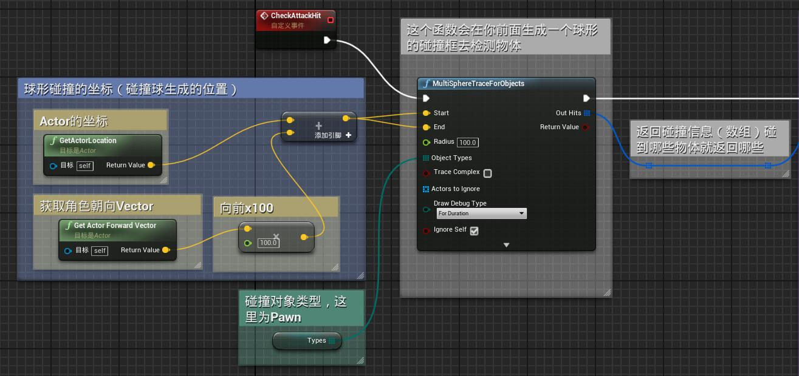  
再将碰撞后的每一个物体进行遍历，判断是否为Monster，如果是则造成伤害。
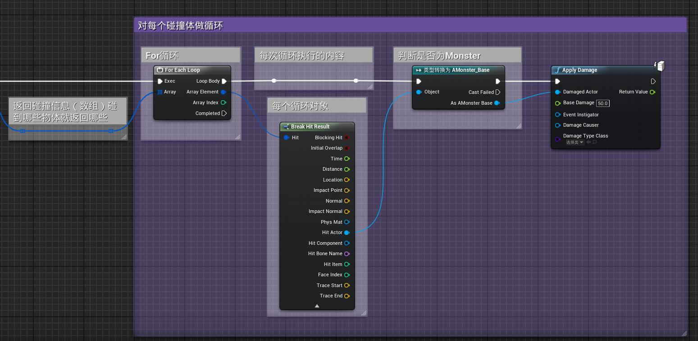

* 由于我们现在的写法还很粗糙，一个角色有多个碰撞体，一次攻击动作会造成与多个碰撞体的触发（造成多次伤害），因此先把mesh碰撞设为no collision，（胶囊还是有碰撞的）这样即可避免。

### 创建伤害函数

* 现在到AMonster_base中编写小怪掉血，新建一个最大血量变量和一个当前血量变量，接受伤害后掉血，避免当前血量低于0。写完后即做好。
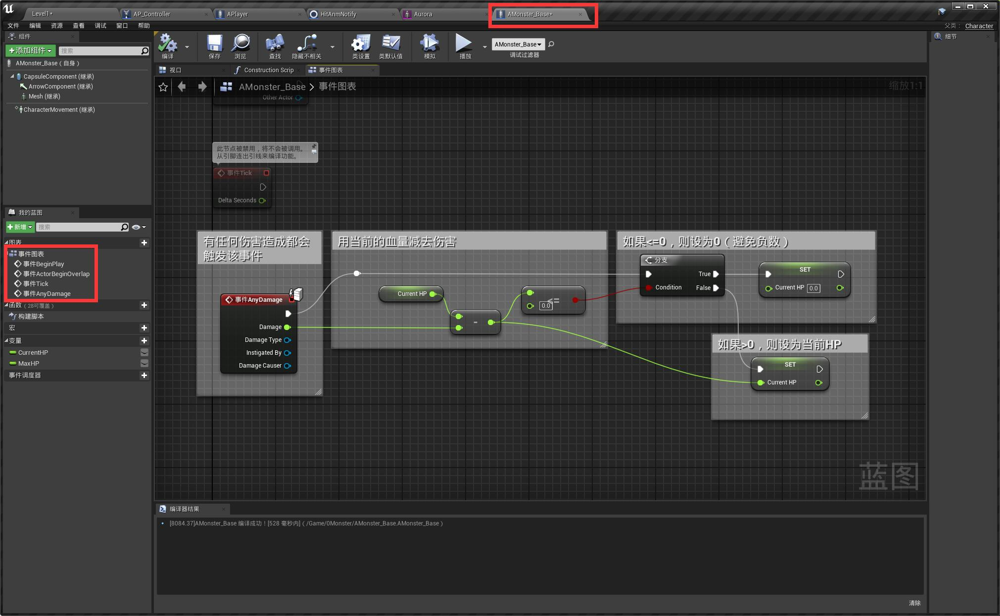

### 做一个血条
* 创建用户界面，控件界面
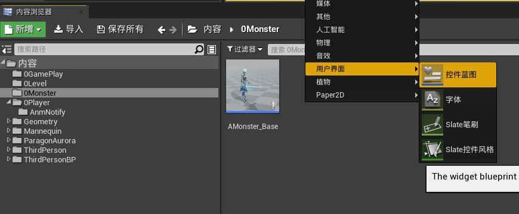

* 点进去创建Progress Bar，左上角的菊花标是锚点，意思是控件的位置依据左上角的距离来定位。
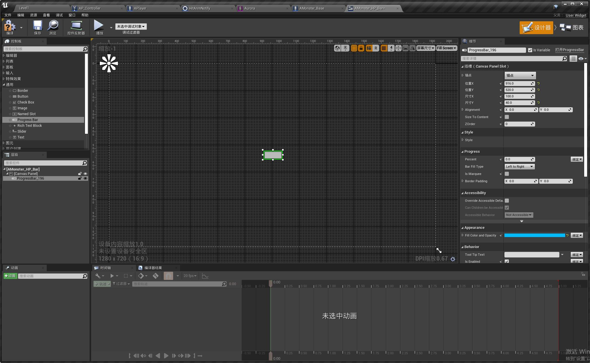

* 将锚点位置选择到中间，Alignment改为0.5的0.5，这样血条就在锚点正中间
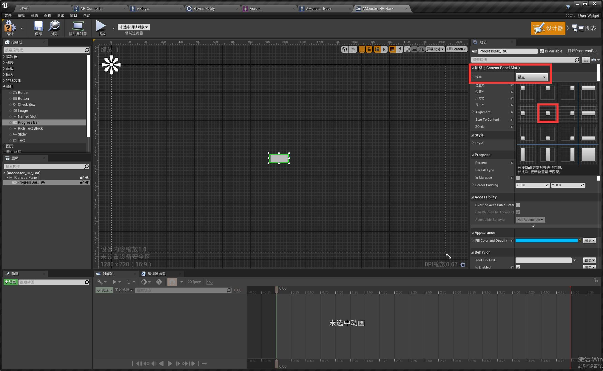

* Percent改为0.5，然后再调整一下血条尺寸和颜色
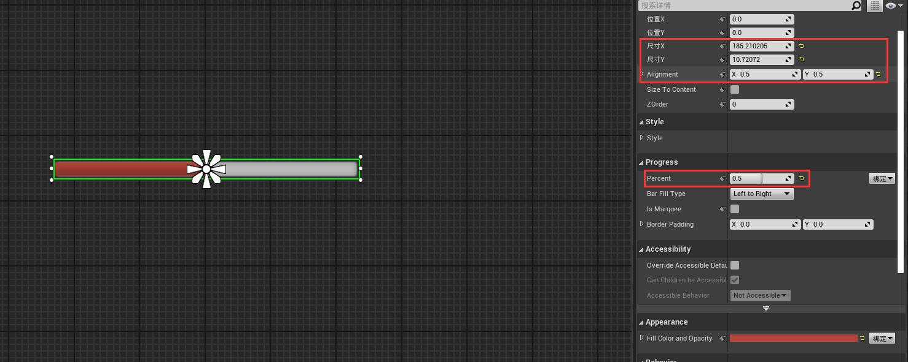

* 然后现在把血条放到怪物身上去，回到AMonsterBase，在胶囊体里添加组件 Widget
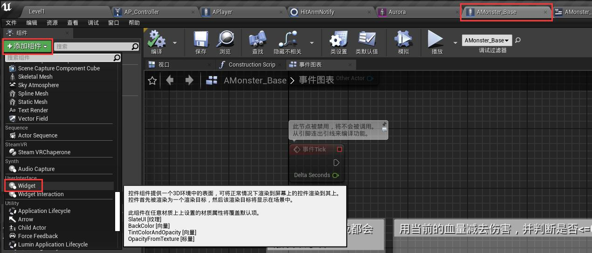

* 右侧widget class选择刚才创建的血条。
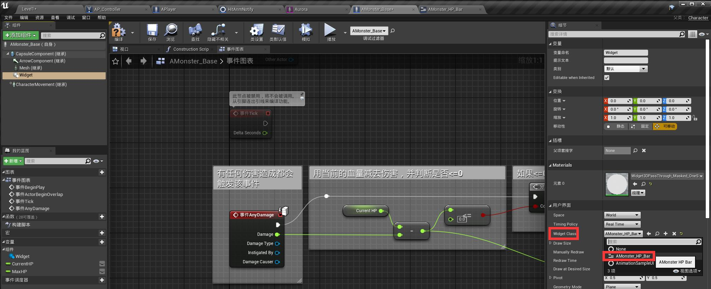

* 现在游戏里是这样子的，首先是血条不跟随你屏幕转，然后位置也不对
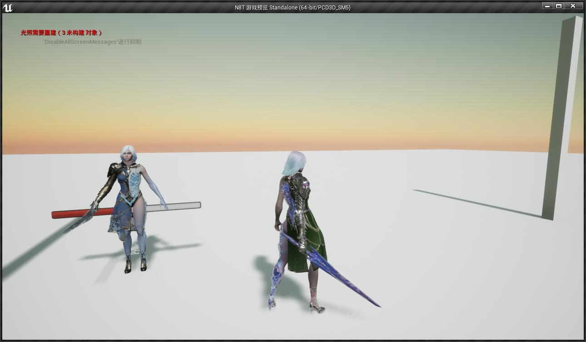

* 因此在视图中将血条移到头上方，再到右侧把用户界面的Space从world改为Screen。
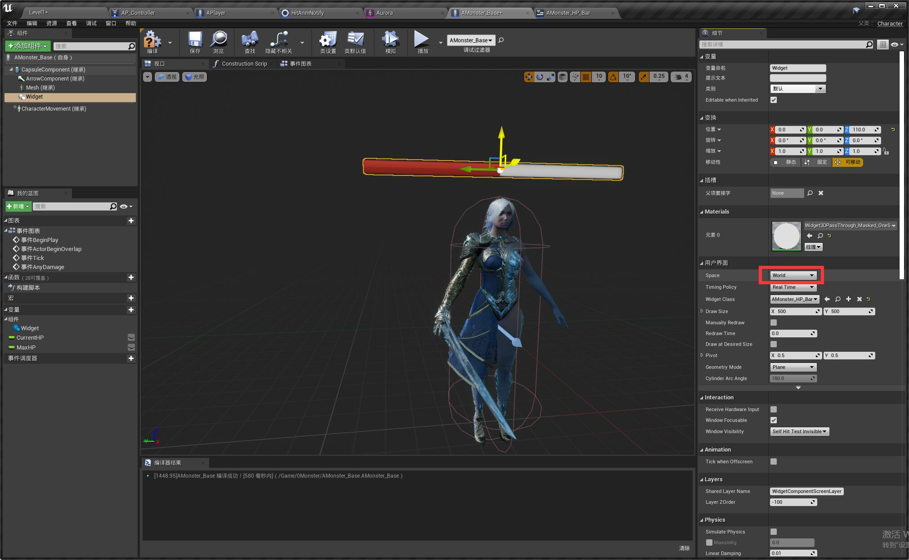

* 然后现在把血量与血条关联上，进入血条界面文件后可以点图表进入蓝图编辑。创建一个Monster类型的变量，点开可编辑实例（公开变量，所有蓝图都可以编辑）
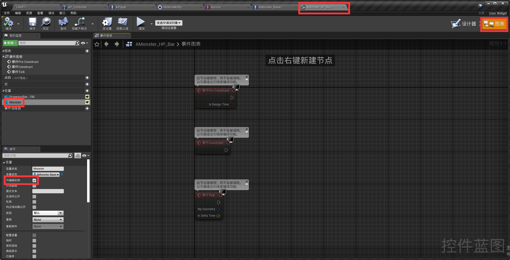

* 回到设计器在Percent后面创建绑定
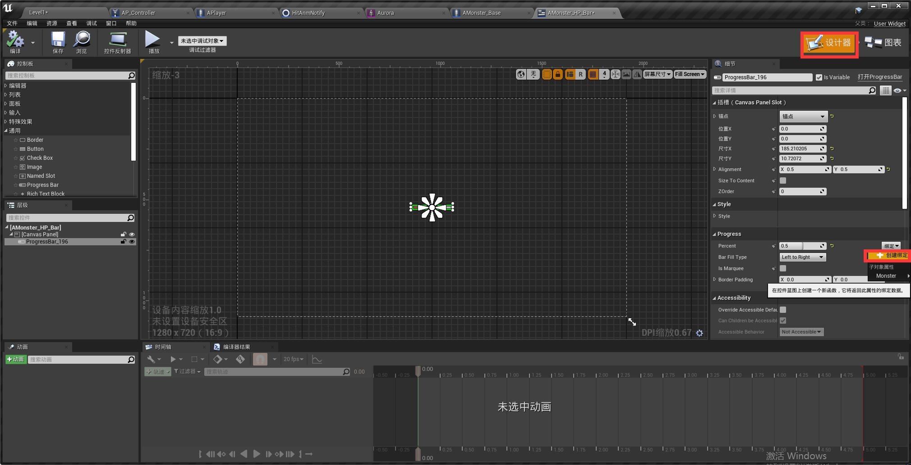

* 在创建好的蓝图里做血量百分比计算，不过注意以防万一，增加一个检查Monster是否合法的，不合法就返回0。
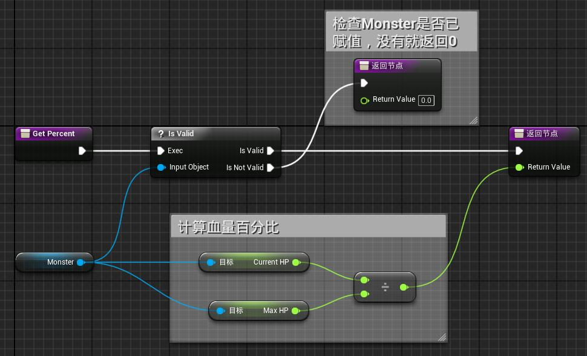

* 因为Monster变量是刚才新建的（现在就没有赋值），因此要在AMonster里去给它赋值。如下图所示。
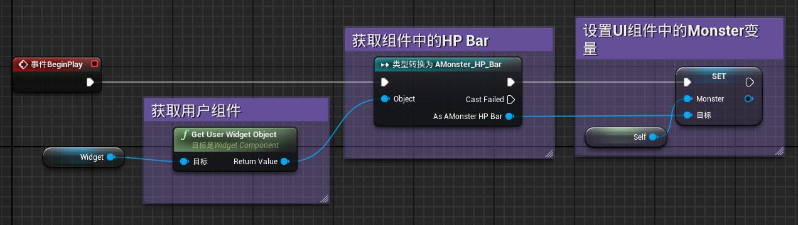

* 现在游戏中血条可以正常掉落了，但是是非平滑掉落的，为了更加好看，我们在血条蓝图中添加如下平滑算法。
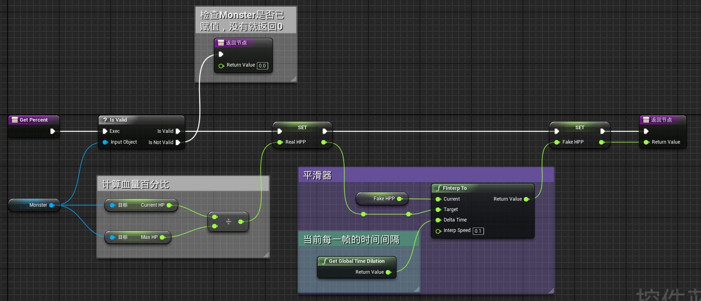